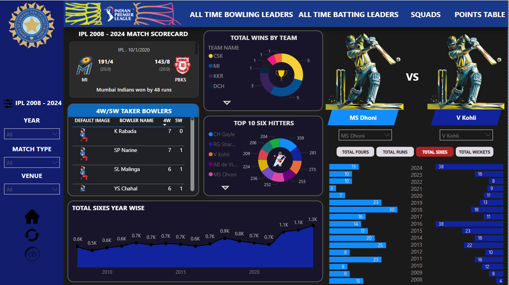
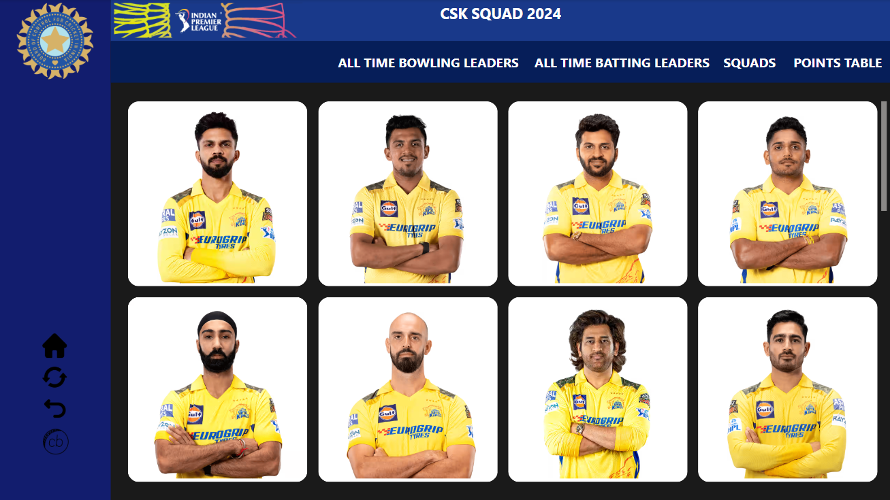
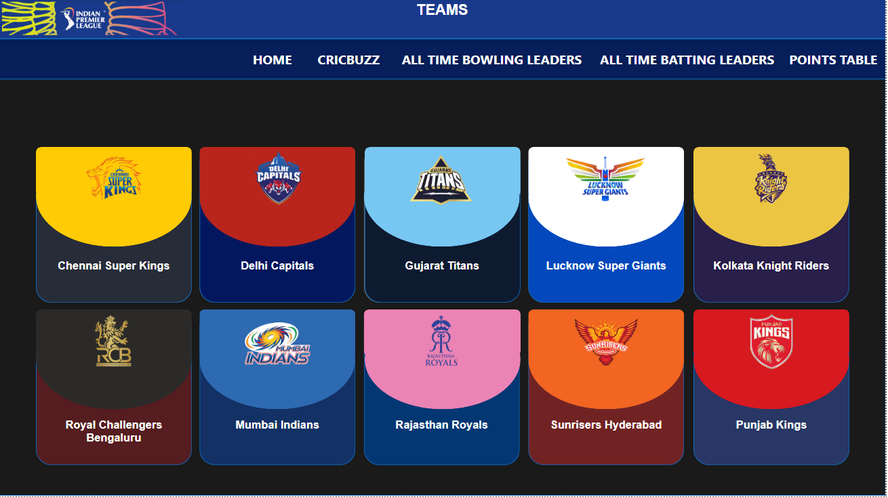
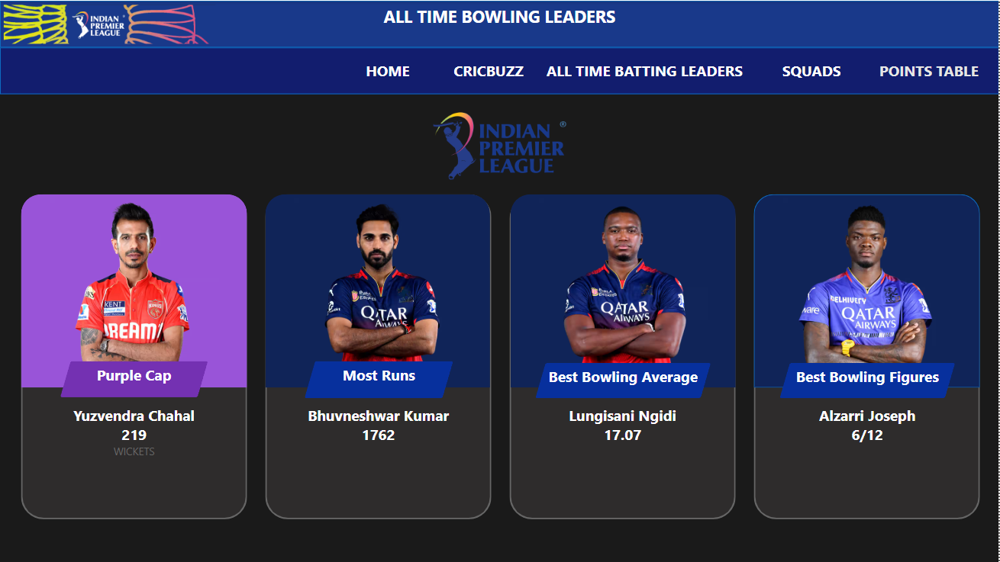
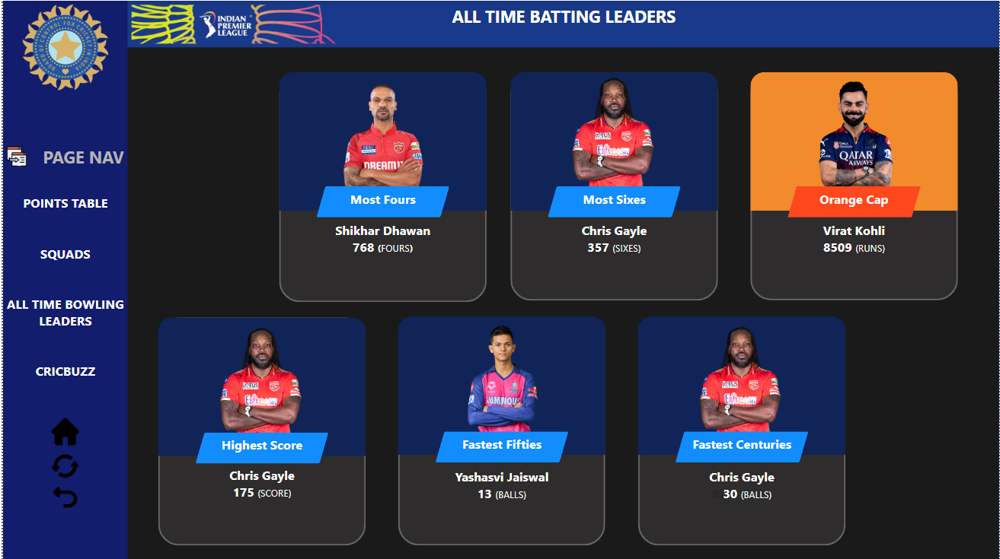
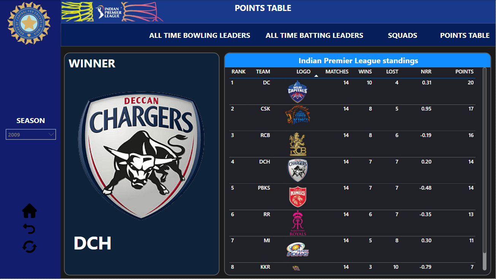
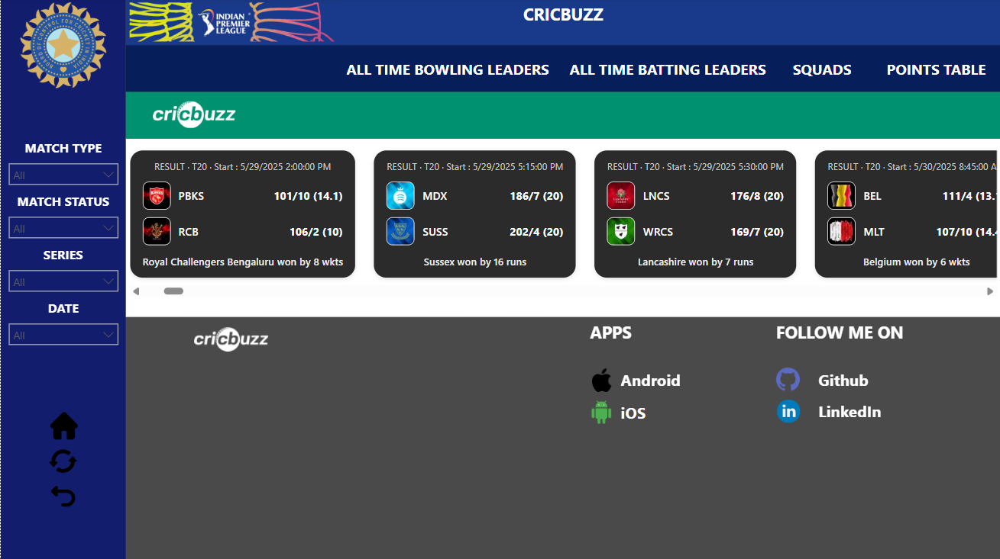

# 🏏 IPL Power BI Dashboard (2008–2024)

This project showcases an end-to-end **IPL Analytics Dashboard** built with **Power BI**, integrating:
- 📊 Historical performance data (2008–2024)
- 🔴 Live match scores using Cricket API
- 🖼️ Custom HTML visuals for scorecards and team displays

---

## 📸 Dashboard Previews

### 📍 Home Page  
Integrated with:
- 🎯 Match Scorecard (HTML Visual)
- ⚔️ Player Comparison (bar charts with filters)
- 🎯 4W/5W Takers Table
- 📈 Line Chart for Year-wise Stat Trends (Runs, Wickets, 4s, 6s)
- 🍩 Donut Chart for Total Wins by Each Team
- 🥧 Pie Charts for Top 10 Wicket Takers, Run Scorers, Six Hitters, and Four Hitters
  

### 📍 CSK 2024 Player Squad  
Displayed using Button slicer visual  

### 📍 Team Selector View  
Includes custom logos and tab-wise navigation  

### 📍 All-Time Bowling Leaders  
Top career wicket-takers  

### 📍 All-Time Batting Leaders  
Includes Orange Cap, Most Sixes, Fifties, and consistent scorers  

### 📍 Points Table & Season Winners (2008–2024)  
Interactive table with yearly team standings and champions 

### 📍 Cricbuzz Live Match Score  
Live score integration using API inside HTML visual  

---

## 📌 Features

- 🖼️ **Match Scorecard Viewer (HTML Visual)**  
  Scrollable and filterable by Year & Match Type (2008–2024) — each match displays a result scorecard inside a styled HTML card.

- ⚔️ **Player vs Player Comparison Tool**  
  Select any two players and compare stats (Runs, 4s, 6s, Wickets) across seasons using bar charts. Includes stat-type selector to dynamically control the view.

- 📈 **Year-wise Aggregate Trends**  
  Line charts for total wickets, sixes, runs, and fours per season from 2008 to 2024.

- 🏆 **Team Trophy Wins Summary**  
  Donut chart showing number of IPL titles won by each team.

- 💥 **Top 10 Performers (Pie Charts)**  
  - 🏏 Top 10 Run Scorers  
  - 🎯 Top 10 Wicket Takers  
  - 💣 Top 10 Six Hitters  
  - 🚩 Top 10 Four Scorers  

- 🧢 **Team Squads (2024)**  
  Each team's full player list is shown via Button slicer visual – styled like official cards. Manually curated using Excel.

- 📊 **Points Table**  
  Interactive year-wise points table with winner display for each season.

- 🔴 **Live Cricbuzz Score Integration**  
  API-connected real-time score displayed in Power BI HTML Viewer visual.

- 🏅 **All-Time Leaders Page**  
  Dedicated tab for:
  - All-Time Batting Leaders
  - All-Time Bowling Leaders

- 📋 **4W/5W Bowling Records Table**  
  A table highlighting players who took 4 or 5 wickets in a match, with total counts of how many such performances they had.

- 🏠 **User Navigation Enhancements**  
  Includes Home Button, Back Button, Refresh Button, and direct navigation buttons to each dashboard tab.

---

## 🧰 Built With

- **Power BI Desktop** – for dashboard creation, DAX formulas, and visuals  
- **Microsoft Excel** – used for:
  - Dataset cleaning using formulas (`SUMIFS`, `VLOOKUP`, etc.)
  - Manual tables (e.g., Team Squads, All-time Bowling/Batting Leaders, Total wins by each team)
- **REST API (Cricbuzz)** – for live match score integration  
- **HTML + JavaScript** – to build interactive visual cards inside Power BI

---

## 📝 Disclaimer

- Data accuracy may slightly vary due to source differences (Kaggle vs official IPL site)
- Live data is fetched from external API and subject to their rate limits or structure

---

## 🙌 Credits

- Dataset from [Kaggle - IPL 2008 to 2024](https://www.kaggle.com/)
- Live data powered by [CricketData.org](https://www.cricketdata.org/)
- Icons & graphics from IPL official site used under fair use for educational/demo purpose

---

## 🚀 Getting Started

1. Download and install [Power BI Desktop](https://powerbi.microsoft.com/desktop/)
2. Clone this repository
3. Open the `.pbix` file in Power BI Desktop
4. Explore and interact with the visualizations

---

## 📃 License

MIT License – Free to use, modify, and share.
